# Enterprise RAG Architecture: Decoupled Retrieval & Observability

A production-grade Retrieval-Augmented Generation (RAG) pipeline designed to solve the standard failure modes of naive LLM wrappers: temporal hallucinations, high token costs on repeat queries, and vocabulary mismatch. 

Built with FastAPI, Qdrant, FastEmbed, and Claude 3.5.

## 🚀 Quick Start
Provide the fastest route to a working demo near the top.

```bash
git clone https://github.com/akarshjain05/rag.git
cd rag
cp .env.example .env  # Add your LLM API keys
docker compose up -d
```
Note: The system requires Qdrant to pass its health check before the FastAPI workers will boot.

## 🏗️ System Architecture
This pipeline isolates retrieval and generation logic to enable independent horizontal scaling of compute and database resources, utilizing **Claude 3.5**, **Qdrant**, **FastAPI**, and **Langfuse/Sentry**.

```mermaid
graph TD
    %% Ingestion Flow
    subgraph INGESTION PIPELINE
        A[Raw Document] --> B[Loader & Normalizer]
        B --> C[Chunking Strategy]
        
        subgraph Anthropic Contextual Retrieval
            C --> D[Full Doc to LLM Cache]
            D -. cache_control: ephemeral .-> E[Chunk Context Generator]
            E --> F[Prepend Summary to Chunk]
        end
        
        F --> G{Hybrid Indexing}
        G --> H[(Qdrant Unified Storage)]
    end

    %% Query Flow
    subgraph RETRIEVAL & GENERATION PIPELINE
        Q[User Query] --> R1[Dense Search]
        Q --> R2[Sparse Search]
        
        R1 --> S[Reciprocal Rank Fusion]
        R2 --> S
        
        S --> T[Cross-Encoder Reranker]
        
        subgraph Corrective RAG & Pruning
            T --> U{Evaluate Max Score}
            U -- "< 0.40" --> V[Graceful Refusal]
            U -- "0.40 - 0.79" --> W[Query Expansion & Re-Search]
            W -. expanded query .-> R1
            U -- "> 0.80" --> X[Dynamic Context Pruning]
            X -- Drop chunks < 0.30 --> Y[Clean Context Window]
        end
        
        Y --> Z[LLM Generator]
        
        subgraph Self-RAG
            Z --> J[Debate Mode: Citation Verifier]
            J -- Groundedness Check --> K[Final Output + Telemetry]
        end
    end
```



**Edge Semantic Caching (Qdrant)**: Intercepts repeat queries using dense vector similarity to return answers in < 100ms at zero LLM cost. The cache is built with production resilience:
- **Negative Cache Prevention:** The system strictly refuses to cache low-confidence or "I don't know" answers, ensuring failures are never permanently lodged in the cache.
- **Fail-Open Timeouts:** Strict 250ms timeouts ensure that vector database hangs gracefully degrade to a cache miss, never stalling user requests.
- **Global Context Sharing:** Standalone (first-turn) queries utilize a globally shared cache namespace, while follow-up queries uniquely isolate against conversation history.
- **Aggressive Invalidation:** The entire semantic cache is flushed upon new document ingestion to ensure real-time accuracy.

**Query Normalization & Condensation**: A fast, cheap LLM rewrites user queries to fix typos, extracts temporal metadata, and resolves conversational follow-ups into standalone queries. To protect dense vector search integrity, the LLM is strictly constrained via Pydantic/JSON schemas to prevent "conversational filler" (e.g., *"Here is the rewritten query:"*) from polluting the mathematical embedding.

**Temporal Hybrid Search (Qdrant)**: Combines BM25 keyword matching with dense vectors, dynamically applying `valid_from` and `valid_to` metadata constraints to strictly enforce point-in-time accuracy.

**Cross-Encoder Reranking (FastEmbed)**: Runs locally on the FastAPI container CPU to re-score Qdrant's candidate chunks, pushing the most semantically relevant context to the top.

**Observability**: All LLM inputs/outputs are traced via Langfuse, and backend performance metrics/errors are captured by Sentry.

## 📸 Interface & Citations


The frontend strictly renders citations mapping directly to the deterministic `chunk_id` stored in the Qdrant payload, ensuring zero hallucinated sources.

## 🧪 Evaluation & CI/CD
This repository utilizes GitHub Actions to execute a continuous integration pipeline on every push.

- Spawns an ephemeral Qdrant service container.
- Runs pytest integration suites to validate normalizer JSON extraction and Corrective RAG (CRAG) fallback logic.

## ⚠️ Limitations & Known Failure Modes
Honestly stating unsupported inputs and known failure modes builds trust and makes your project highly credible.

- **Multilingual Support**: The local cross-encoder model is currently optimized for English-only embeddings.
- **Token Windows**: Extremely large retrieved chunks may truncate if they exceed the context window constraints of the Tier 1 generator model.
