# Production RAG Architecture Flow

This document outlines the exact, step-by-step lifecycle of data and queries through the state-of-the-art Retrieval-Augmented Generation (RAG) pipeline.

## System Architecture

```mermaid
graph TD
    %% Ingestion Flow
    subgraph INGESTION PIPELINE
        A[Raw Document] --> B[Loader & Normalizer]
        B --> C[Chunking Strategy]
        
        subgraph Anthropic Contextual Retrieval
            C --> D[Full Doc to LLM Cache]
            D -. cache_control: ephemeral .-> E[Chunk Context Generator]
            E --> F[Prepend Summary to Chunk]
        end
        
        F --> G{Hybrid Indexing}
        G --> H[(Qdrant Unified Storage)]
    end

    %% Query Flow
    subgraph RETRIEVAL & GENERATION PIPELINE
        Q[User Query] --> R1[Dense Search]
        Q --> R2[Sparse Search]
        
        R1 --> S[Reciprocal Rank Fusion]
        R2 --> S
        
        S --> T[Cross-Encoder Reranker]
        
        subgraph Corrective RAG & Pruning
            T --> U{Evaluate Max Score}
            U -- "< 0.40" --> V[Graceful Refusal]
            U -- "0.40 - 0.79" --> W[Query Expansion & Re-Search]
            W -. expanded query .-> R1
            U -- "> 0.80" --> X[Dynamic Context Pruning]
            X -- Drop chunks < 0.30 --> Y[Clean Context Window]
        end
        
        Y --> Z[LLM Generator]
        
        subgraph Self-RAG
            Z --> J[Debate Mode: Citation Verifier]
            J -- Groundedness Check --> K[Final Output + Telemetry]
        end
    end
```

## 1. Ingestion Lifecycle

1. **Extraction & Normalization**: The pipeline ingests PDFs, HTML, or Markdown, stripping formatting and normalizing headers into standard markdown equivalents.
2. **Chunking**: Documents are split based on the selected strategy (Semantic, Structure-Aware, or Fixed-size).
3. **Embedding (Dense Vectors)**: The extracted chunks are embedded sequentially using either an OpenAI or local SentenceTransformers client. Large >1MB files are routed to a Celery worker backed by Redis and MinIO for streaming processing to avoid memory bloat.
4. **Anthropic Contextual Retrieval & Prompt Caching**:
   - The *entire* source document is loaded into the LLM's `system` array with `"cache_control": {"type": "ephemeral"}`.
   - The LLM iterates over every chunk using a `ThreadPoolExecutor` (guaranteeing exact-prefix matching and a 99%+ cache hit rate) to synthesize a context summary that situates the isolated chunk within the broader document.
   - The synthetic summary is prepended to the chunk text to maximize keyword exposure for the Sparse Index and Generator LLM.
5. **Unified Qdrant Indexing**: Both the Dense Vector and the Sparse Vector (computed natively via Qdrant's FastEmbed `Qdrant/bm25` using the Anthropic summaries if enabled) are upserted into a single Qdrant `PointStruct`.

## 2. Query Lifecycle

1. **Hybrid Retrieval**: The user's query is sent in a single highly-optimized API call to Qdrant via `models.Prefetch` and `models.FusionQuery(fusion=models.Fusion.RRF)`. Qdrant's Rust engine handles both dense and sparse retrieval concurrently, fuses their ranks natively in memory, and returns only the finalized Top-25 list, eliminating massive network overhead.
3. **Cross-Encoder Reranking**: A specialized Cross-Encoder model (`BAAI/bge-reranker-v2-m3`) evaluates the query against each chunk, outputting a highly calibrated relevance probability (0.00 to 0.99).
4. **Corrective RAG (CRAG) Routing**: The system checks the `max()` score among the reranked chunks:
   - **Low Confidence (< 0.40)**: Short-circuits the pipeline and returns a graceful refusal to prevent hallucinations.
   - **Ambiguous Confidence (0.40 - 0.79)**: Triggers an automatic fallback. An LLM expands the query with technical synonyms/acronyms, and re-runs the Hybrid Search. If the new chunks score higher, they dynamically swap into the pipeline.
   - **High Confidence (> 0.80)**: Proceeds normally.
5. **Dynamic Context Pruning**: To prevent the "Lost in the Middle" effect, any chunk that falls below the 0.30 rerank threshold is aggressively pruned. The LLM only receives highly concentrated, relevant context.
6. **Generation**: The LLM synthesizes an answer with inline citation markers mapping back to the surviving chunks.
7. **Self-RAG (Strict Verification)**: If "Debate Mode" is enabled, a secondary "LLM as a judge" intercepts the output. It splits the answer into individual factual claims and mathematically verifies that every claim is explicitly supported by the cited chunk.
8. **Telemetry Export**: The API responds with the generated answer, alongside advanced metadata: `composite_confidence`, `citation_coverage`, and `retrieval_confidence` for frontend visualization.
